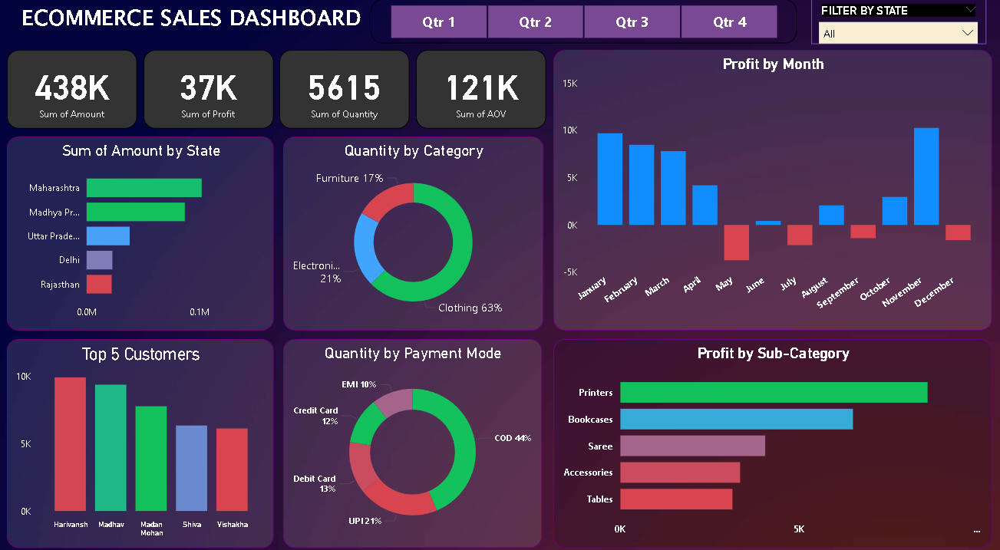

# Sales Dashboard Analysis
## Screenshots

An interactive Power BI dashboard to track and analyze online sales data. Features custom visualizations and filters to explore trends and insights.

## Installation
1. Install Power BI Desktop (free from Microsoft).
2. Clone this repo: `git clone https://github.com/yourusername/sales-dashboard.git`.
3. Open 'Ecommerece Sales Dashboard.pbit' in Power BI.

## Usage
Open 'Ecommerece Sales Dashboard.pbit' in Power BI Desktop, Interact, or make changes as you like.

## Features
- Interactive bar, pie, and map visualizations.
- Custom slicers for dynamic filtering.
- Drill-down options for detailed analysis.

## Data Sources
Sample data 'Orders.csv' and 'Details.csv'.  Update the source in Power BI with your own Excel or SQL data. It is a sample source anyways

## Orders.csv information
Contains 5 columns and 501 rows. Columns contain orderID, OrderDate, CustomerName, State, City. 

## License
Licensed under the MIT License. See 'LICENSE' for details.
